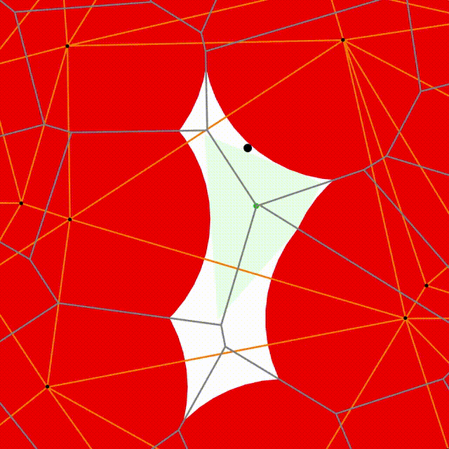
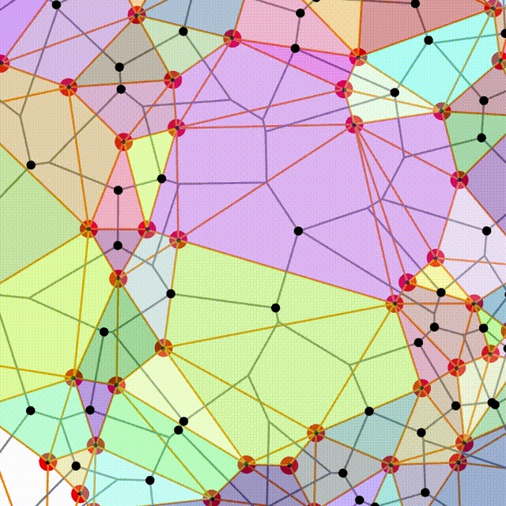

## **Volume Ascent Edge Algorithm**

The **VA-edge** algorithm is composed of **three main stages**:

---

### **1. Sampling**

* Uniformly sample **`M` points** in a **spherical shell** centered at the origin in `d` dimensions.
* Each point represents an **obstacle center**.

---

### **2. Initial Projection**

* **Find the closest center** to the origin:

  ```math
  \mathbf{p}_0 = \arg\min_{\mathbf{o}_i} |\mathbf{o}_i|
  ```
* Set the **initial velocity**:

  ```math
  \hat{\mathbf{v}}_0 = -\frac{\mathbf{p}_0}{|\mathbf{p}_0|}
  ```
* **Project** the motion from the origin through `d` steps:

  * At each step, select the **next closest point** in the direction of motion.
  * **Update** position and **project** velocity orthogonally to previously visited points.
  * After `d` steps, reach the first **Voronoi vertex (VV)**, the **circumcenter** of `d+1` points.

---

### **3. Edge Walk (VA-edge)**

* If the current VV is **not inside** its simplex:

  * For each point `p_j` in the simplex:

    * Compute the **circumcenter and radius** of the `(d-1)`-simplex excluding `p_j`.
    * Determine the **Voronoi edge vector** `e_j`.
    * Check if this edge is a valid **expansion direction**.
  * **Select the edge** with the **maximal (or minimal) expansion ratio**:

    ```math
    k_{\text{max}} = \arg\max_j \frac{|e_j|}{r_j}
    ```
  * Walk along this edge until intersecting a new point.
  * **Update** the simplex by replacing `p_{k_{\text{max}}}` with the new point.
  * **Repeat** until the VV lies inside its simplex → **stable configuration** (an IS).

---

### **Video**

### Simulation Videos


*Geometry of one VA-max step in `d=2`*



*Example of Delaunay Basins in `d=2`*

---

**Note**: Full algorithmic details are in the paper [Jamming the Random Lorentz Gas](https://arxiv.org/abs/2410.05784).
